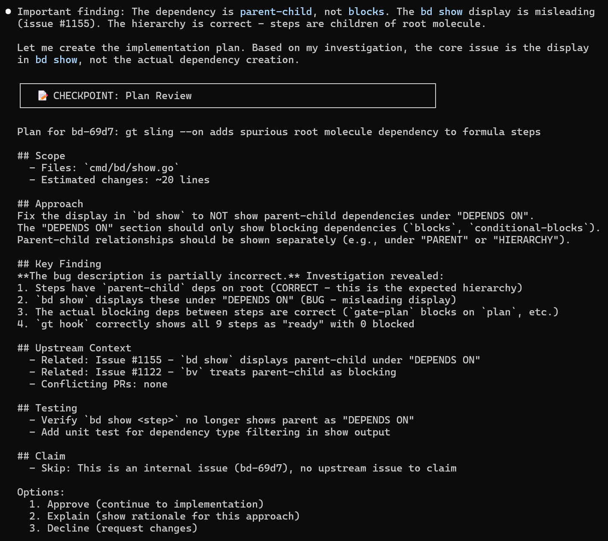
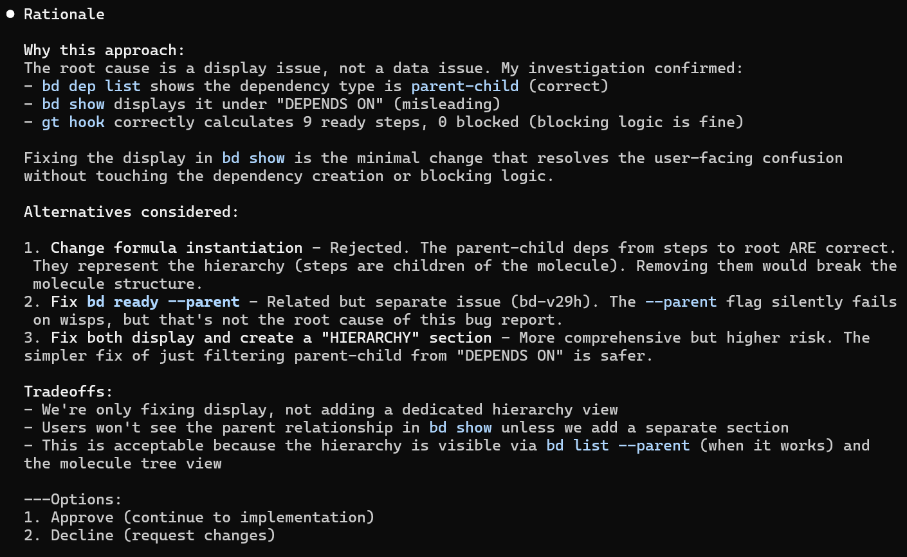
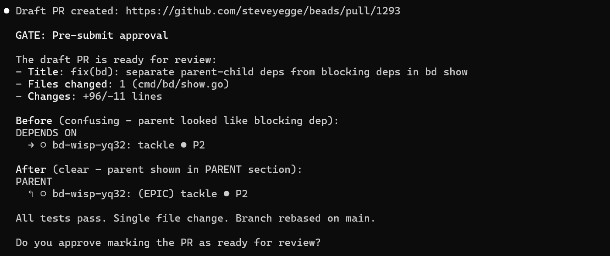
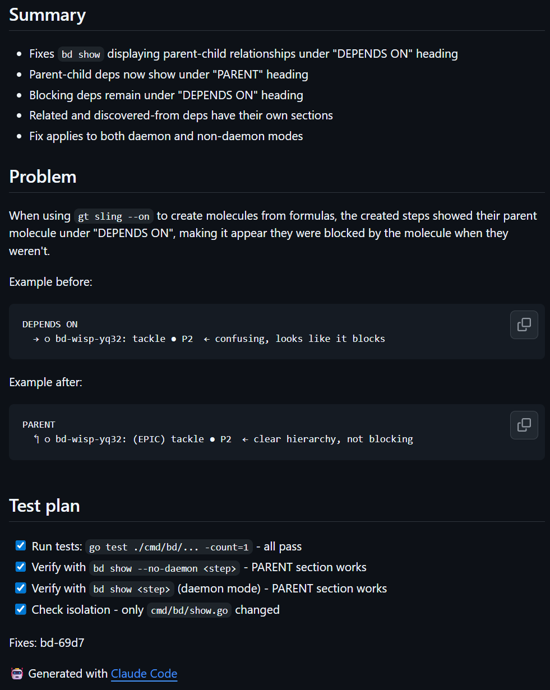
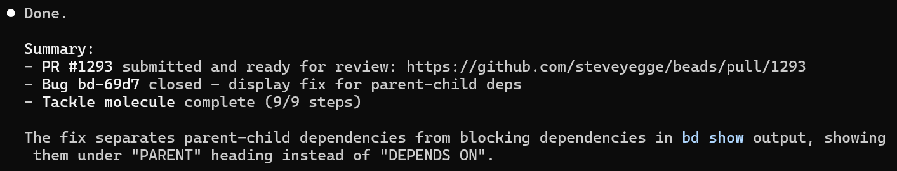

# Tackle - Upstream-Aware Contribution Workflow

A Claude Code skill for contributing to open source projects with mandatory human approval gates and self-improvement.

## Quick Start

```
/tackle <issue>       # Start working on an issue
/tackle --help        # Show all commands
```

## Dependencies

**Required:**
- [gh](https://cli.github.com/) - GitHub CLI for API access
- [jq](https://jqlang.github.io/jq/) - JSON processing

**Optional (graceful fallback without):**
- [yq](https://github.com/mikefarah/yq) - YAML parsing for `.beads/config.yaml`
  - Without yq: only the primary upstream repo is checked for existing work
  - With yq: additional tracked repos from config are also searched
  - Install: `brew install yq` (macOS) or `sudo apt install yq` (Debian/Ubuntu)
  - Commands using yq fail silently and fall back to defaults

## What It Does

1. **Research** - Fetches upstream CONTRIBUTING.md, open issues, and PRs. Caches for fast reuse.
2. **Duplicate Detection** - Searches for existing PRs that address your issue before you start coding.
3. **Plan** - Creates an implementation plan based on upstream conventions.
4. **🚧 GATE: Plan Review** - Stops and waits for your approval before coding.
5. **Implement** - Writes code following detected project style.
6. **Validate** - Runs tests, checks that changes are isolated to a single concern.
7. **🚧 GATE: Pre-Submit Review** - Creates a draft PR for your review. Stops and waits for approval.
8. **Submit** - Marks the draft PR ready for maintainer review.
9. **Reflect** - Reviews the run for friction points and proposes skill improvements.

## Key Features

- **Mandatory approval gates** - No code written or PR submitted without explicit human sign-off
- **Upstream-aware** - Checks for existing fixes before duplicating work
- **Convention-following** - Parses CONTRIBUTING.md and applies commit style, test requirements, PR format
- **Self-improving** - Logs issues and detects patterns across runs; proposes fixes after 2+ occurrences
- **Session-resilient** - State persists via beads molecules; resume after compaction or new session

## Screenshots

### Plan Gate
The first approval gate presents the implementation plan with scope, approach, and alternatives:



Ask for rationale and the agent explains tradeoffs:



### Pre-Submit Gate
Before submitting, a draft PR is created for review:



The draft PR on GitHub shows the full summary and test plan:



### Completion
After approval, the PR is marked ready and the tackle completes:



## Inspiration

Built on ideas from:
- [boshu2/agentops pr-kit](https://github.com/boshu2/agentops)
- [AI-Unleashed/Claude-Skills autoskill](https://github.com/AI-Unleashed/Claude-Skills/tree/main/autoskill)
